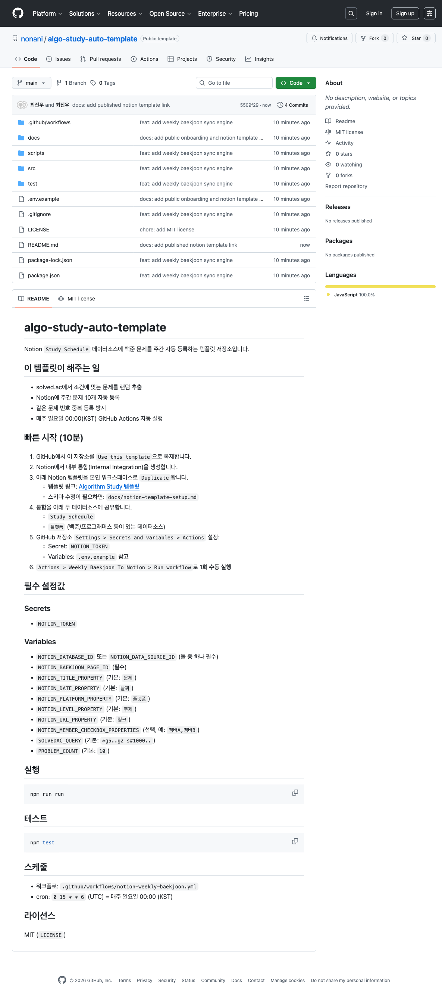
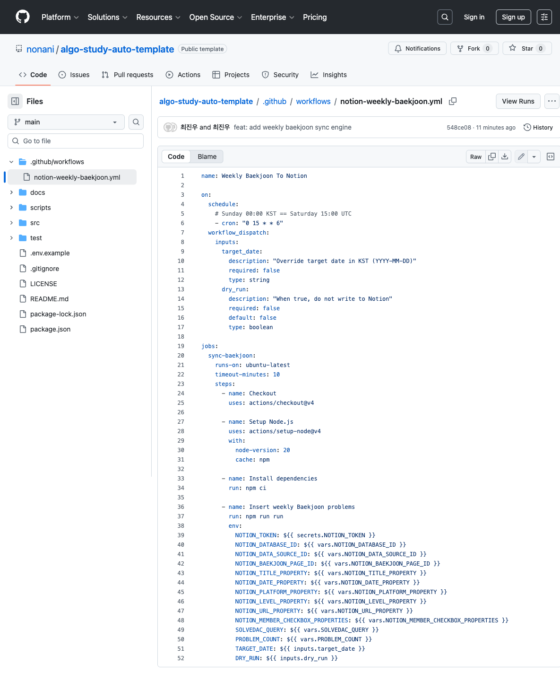

# algo-study-auto-template

Notion `Study Schedule`에 백준 문제를 자동 등록하는 GitHub Actions 템플릿입니다.



## 이 템플릿이 하는 일
- solved.ac 검색 조건으로 문제를 랜덤 추출합니다.
- 매주 10문제를 Notion에 자동 등록합니다.
- 이미 등록된 백준 문제 번호는 다시 넣지 않습니다.
- 매주 일요일 00:00(KST)에 자동 실행됩니다.

## 0. 준비물
- GitHub 계정
- Notion 워크스페이스(통합 생성 권한)
- 자동화 대상 Notion 템플릿
  - [Algorithm Study 템플릿 열기](https://chalk-sociology-0dc.notion.site/Algorithm-Study-30d06739c57181fe81d7f2843d560f1c?pvs=73)


## 1. 템플릿 레포 복제
1. GitHub에서 `Use this template` 클릭
2. 본인 계정으로 새 저장소 생성

## 2. Notion 템플릿 복제
1. 위 Notion 템플릿 링크 접속
2. 우측 상단 `Duplicate`로 본인 워크스페이스에 복제
3. 아래 두 데이터소스가 있어야 합니다.
   - `Study Schedule`
   - `플랫폼` (`백준` 페이지 포함)

상세 스키마는 `docs/notion-template-setup.md`를 참고하세요.

## 3. Notion API 통합 생성 및 공유
1. Notion에서 Internal Integration 생성
2. 발급된 시크릿 값을 복사
3. 복제한 템플릿의 두 데이터소스에 통합을 `연결`/`초대`
   - `Study Schedule`
   - `플랫폼`

## 4. GitHub Secrets/Variables 설정
경로: `Settings > Secrets and variables > Actions`

### Secrets
- `NOTION_TOKEN` (필수): Notion Internal Integration 시크릿

### Variables
- `NOTION_DATA_SOURCE_ID` 또는 `NOTION_DATABASE_ID` (둘 중 하나만 필수)
- `NOTION_BAEKJOON_PAGE_ID` (필수)
- `SOLVEDAC_QUERY` (선택, 기본 `*g5..g2 s#1000..`)
- `PROBLEM_COUNT` (선택, 기본 `10`)

아래는 선택값이며 기본값으로도 동작합니다.
- `NOTION_TITLE_PROPERTY` (기본 `문제`)
- `NOTION_DATE_PROPERTY` (기본 `날짜`)
- `NOTION_PLATFORM_PROPERTY` (기본 `플랫폼`)
- `NOTION_LEVEL_PROPERTY` (기본 `주제`)
- `NOTION_URL_PROPERTY` (기본 `링크`)
- `NOTION_MEMBER_CHECKBOX_PROPERTIES` (예: `멤버A,멤버B`)

전체 목록은 `.env.example`를 그대로 참고하면 됩니다.

## 5. 첫 실행(수동 테스트)
1. `Actions > Weekly Baekjoon To Notion > Run workflow`
2. `target_date`는 비워두면 이번 주 일요일(KST)로 자동 계산
3. `dry_run`을 체크하면 Notion에 쓰지 않고 미리보기만 수행
4. 성공 로그 확인 후 Notion에서 행 생성 확인



## 6. 자동 실행 스케줄
- 워크플로: `.github/workflows/notion-weekly-baekjoon.yml`
- cron: `0 15 * * 6` (UTC)
- 한국 시간 기준: 매주 일요일 00:00 (KST)

`schedule`가 있으므로 수동 실행 없이도 자동으로 실행됩니다.

## 자주 헷갈리는 점
- `NOTION_DATABASE_ID`가 꼭 필요한가요?
  - 아니요. `NOTION_DATA_SOURCE_ID`를 넣으면 `NOTION_DATABASE_ID`는 없어도 됩니다.
- `target_date`를 매번 입력해야 하나요?
  - 아니요. 수동 테스트 시 특정 날짜 강제 실행이 필요할 때만 넣습니다.
- 중복 문제가 다시 들어갈 수 있나요?
  - 이 스크립트는 기존 백준 문제 번호를 조회해 중복을 피합니다.

## 로컬 실행/테스트
```bash
npm run run
npm test
```

## 라이선스
MIT (`LICENSE`)
