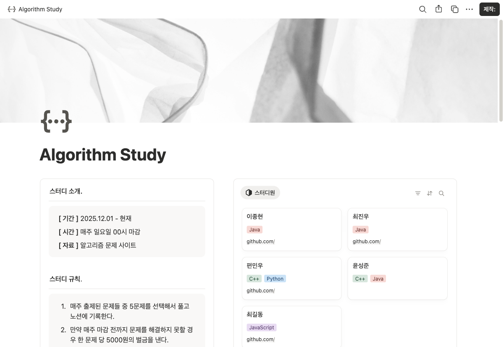

# Notion 템플릿 구성 가이드

아래 구조를 맞추면 템플릿 저장소를 그대로 사용할 수 있습니다.



## 1) `플랫폼` 데이터소스 준비
필수 조건:
- `백준` 페이지가 반드시 1개 있어야 합니다.
- 이 `백준` 페이지 ID를 `NOTION_BAEKJOON_PAGE_ID`로 사용합니다.

권장 속성 예시:
- `이름` (title)
- `홈페이지` (url 또는 rich_text)

## 2) `Study Schedule` 데이터소스 속성 맞추기
필수 속성:
- `문제` (title)
- `날짜` (date)
- `플랫폼` (relation -> `플랫폼` 데이터소스)

선택 속성:
- `주제` (rich_text/select/multi_select/number 중 하나)
- `링크` (url 또는 rich_text)
- 멤버 체크박스들 (checkbox, 예: `멤버A`, `멤버B`)

멤버 체크박스를 자동 초기화하려면:
- `NOTION_MEMBER_CHECKBOX_PROPERTIES=멤버A,멤버B`

## 3) 환경변수-속성 매핑표
이름이 다르면 변수값만 바꿔서 맞추면 됩니다.

| GitHub Variable | Notion 속성명 예시 | 필수 |
| --- | --- | --- |
| `NOTION_TITLE_PROPERTY` | `문제` | 선택 |
| `NOTION_DATE_PROPERTY` | `날짜` | 선택 |
| `NOTION_PLATFORM_PROPERTY` | `플랫폼` | 선택 |
| `NOTION_LEVEL_PROPERTY` | `주제` | 선택 |
| `NOTION_URL_PROPERTY` | `링크` | 선택 |

기본값은 README 기준으로 이미 설정돼 있어, 기본 속성명을 그대로 쓰면 별도 수정이 필요 없습니다.

## 4) Integration 권한 연결
생성한 Notion Internal Integration을 아래 두 데이터소스에 모두 연결해야 합니다.
- `Study Schedule`
- `플랫폼`

누락 시 자주 나는 오류:
- `object_not_found`
- `Could not find database`

## 5) ID 추출 방법
### 5-1) `NOTION_BAEKJOON_PAGE_ID`
- 가장 쉬운 방법:
  - `플랫폼` 데이터소스의 `백준` 페이지를 열고 URL의 32자리 ID를 복사합니다.
- API로 정확히 찾는 방법:
  - 먼저 `플랫폼` 데이터소스 ID를 준비합니다.
    - 이미 알고 있으면 `NOTION_PLATFORM_DATA_SOURCE_ID`로 사용
    - 모르면 `플랫폼` 데이터베이스 ID로 아래처럼 조회

```bash
export NOTION_TOKEN='ntn_xxx'
export NOTION_PLATFORM_DATABASE_ID='xxxxxxxxxxxxxxxxxxxxxxxxxxxxxxxx'

export NOTION_PLATFORM_DATA_SOURCE_ID=$(
  curl -sS "https://api.notion.com/v1/databases/${NOTION_PLATFORM_DATABASE_ID}" \
    -H "Authorization: Bearer ${NOTION_TOKEN}" \
    -H "Notion-Version: 2025-09-03" \
    | jq -r '.data_sources[0].id'
)
```

```bash
curl -sS -X POST "https://api.notion.com/v1/data_sources/${NOTION_PLATFORM_DATA_SOURCE_ID}/query" \
  -H "Authorization: Bearer ${NOTION_TOKEN}" \
  -H "Notion-Version: 2025-09-03" \
  -H "Content-Type: application/json" \
  -d '{"page_size":100}' \
  | jq -r '.results[] | [.id, (.properties | to_entries[] | select(.value.type=="title") | .value.title | map(.plain_text) | join(""))] | @tsv'
```

- 출력에서 제목이 `백준`인 행의 첫 번째 컬럼(ID)을 `NOTION_BAEKJOON_PAGE_ID`로 넣으면 됩니다.

### 5-2) `NOTION_DATABASE_ID`
- `Study Schedule` 화면 URL의 32자리 ID를 복사해 사용해도 됩니다.
- 하이픈 없는 32자리 문자열 그대로 넣어도 스크립트가 자동 변환합니다.

예시:
- `https://www.notion.so/<32자리ID>?v=...`

### 5-3) `NOTION_DATA_SOURCE_ID` 정확히 찾기
`NOTION_DATA_SOURCE_ID`는 아래 API 호출로 정확히 확인할 수 있습니다.

```bash
export NOTION_TOKEN='ntn_xxx'
export NOTION_DATABASE_ID='xxxxxxxxxxxxxxxxxxxxxxxxxxxxxxxx'

curl -sS "https://api.notion.com/v1/databases/${NOTION_DATABASE_ID}" \
  -H "Authorization: Bearer ${NOTION_TOKEN}" \
  -H "Notion-Version: 2025-09-03" \
  | jq -r '.data_sources[0].id'
```

- 출력값을 GitHub Variable `NOTION_DATA_SOURCE_ID`에 넣으면 됩니다.
- 또는 `NOTION_DATABASE_ID`만 설정해도 현재 템플릿 스크립트는 동작합니다.
